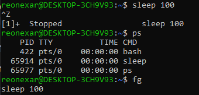

## Instrucciones de la práctica  

En esta práctica se trabajará en **dos fases complementarias**:

1. **Parte teórica:** Responde a los conceptos solicitados mediante la **búsqueda de información confiable**, citando siempre las **fuentes consultadas** al final de cada respuesta.  
2. **Parte práctica:** Ejecuta en Linux los **comandos indicados** y muestra la **salida obtenida** junto con una breve explicación de su significado.  

El objetivo es afianzar la comprensión de los **procesos en sistemas operativos**, tanto desde el punto de vista conceptual como práctico.  


## Bloque 1: Conceptos básicos (teoría)

### Ejercicio 0 (ejemplo resuelto)  

**Pregunta:** Explica la diferencia entre hardware, sistema operativo y aplicación.  

**Respuesta:**  

- **Hardware**: parte física (CPU, memoria, disco, etc.).  
- **Sistema Operativo (SO)**: software que gestiona el hardware y ofrece servicios a las aplicaciones (ejemplo: Linux, Windows).  
- **Aplicación**: programas que usa el usuario y que se apoyan en el SO (ejemplo: navegador, editor de texto).  

---

1. Define qué es un **proceso** y en qué se diferencia de un **programa**.  

    El programa es un código guardado en un disco duro para una fase previa del proceso. El proceso es un evento de ese programa en ejecución.

    --[www.profesionalreview.com](https://www.profesionalreview.com/2019/09/23/proceso-informatico)--
    
2. Explica qué es el **kernel** y su papel en la gestión de procesos.  

    El kernel es el núcleo del sistema operativo y actúa como intermediario entre el hardware y el software. Su papel es fundamental para que cualquier dispositivo funcione de forma estable y eficiente.
    Cada vez que se abre una aplicación, el sistema crea un proceso, y es el kernel quien se encarga de controlar su ciclo de vida. Desde la creación, asignación de recursos y ejecución, hasta la finalización del proceso.

    --[https://www.hackio.com](https://www.hackio.com/blog/que-es-el-kernel-cual-es-su-trabajo-y-como-funciona)--

3. ¿Qué son **PID** y **PPID**? Explica con un ejemplo.  

    Es el identificador de el procceso asi que si iniciamos 5 veces el mismo proceso obtendremos un PID (Process ID) diferente en cada ocasión
    El PPID (Parent Process ID) es el PID del proceso que lo inició. Todos los procesos tienen un padre, salvo el proceso 0. Este último es un pseudo-proceso que representa el inicio del sistema y que inicia al PID 1.

    --[https://blog.carreralinux.com.ar](https://blog.carreralinux.com.ar/2018/04/informacion-sobre-procesos-resumen-datos)--

4. Describe qué es un **cambio de contexto** y por qué es costoso.  

    Los cambios de contexto en programación hacen referencia a la acción de detener la ejecución de un proceso actual en un sistema operativo y cambiar al proceso seleccionado.
    Cuantos más cambios de contexto se produzcan, más tiempo se dedicará a administrar estos cambios en lugar de ejecutar tareas útiles.

    --[keepcoding.io](https://keepcoding.io/blog/cambios-de-contexto-en-programacion)--

5. Explica qué es un **PCB (Process Control Block)** y qué información almacena.  

    A Process Control Block (PCB) is a data structure used by the operating system to keep track of process information and manage execution.
    The PCB stores details such as process state, program counter, stack pointer, open files, and scheduling info.

    --[www.geeksforgeeks.org](https://www.geeksforgeeks.org/operating-systems/process-table-and-process-control-block-pcb)--

6. Diferencia entre **proceso padre** y **proceso hijo**.  

    Los procesos existen en jerarquías de padre-hijo. Un proceso iniciado por un programa o mandato es un proceso padre; un proceso hijo es el producto del proceso padre. Un proceso padre puede tener varios procesos hijo, pero un proceso hijo sólo puede tener un padre.

    --[www.ibm.com](https://www.ibm.com/docs/es/aix/7.2.0?topic=processes-)--

7. Explica qué ocurre cuando un proceso queda **huérfano** en Linux.  

    Normalmente un proceso hijo termina antes que un proceso padre, pero se puede dar la situación de
    que se mate a un proceso padre ( killed ) y el hijo se quede sin padre ( que crueldad ). Entonces el
    proceso init lo adoptara como hijo, pero como su padre original no existe, es considerado huérfano

    --[elbinario.net](https://elbinario.net/wp-content/uploads/2015/01/011-Procesos.pdf)--

8. ¿Qué es un proceso **zombie**? Da un ejemplo de cómo puede ocurrir.

    Un proceso zombie es un proceso finalizado que ya no se ejecuta pero que sigue reconociéndose en la tabla de procesos (en otras palabras, tiene un número PID).
    Suele pasar porque su proceso padre no ha recogido su estado de salida, lo que impide su completa eliminación de la memoria.

    --[www.ibm.com](https://www.ibm.com/docs/es/aix/7.1.0?topic=processes-)--

9. Diferencia entre **concurrencia** y **paralelismo**.  

    La concurrencia y el paralelismo está muy relacionados, pero no son la misma cosa, por lo tanto, la concurrencia ayuda a procesar varias tareas al mismo tiempo, mientras que el paralelismo resuelve una única tarea de una forma mucho más eficiente.

    --[www.oscarblancarteblog.com](https://www.oscarblancarteblog.com/2017/03/29/concurrencia-vs-paralelismo)--

10. Explica qué es un **hilo (thread)** y en qué se diferencia de un proceso.  

    Los procesos suelen ser independientes, mientras que los hilos existen como subconjuntos de un proceso.
    
    Cada proceso tiene su propio espacio de memoria. Los hilos que pertenecen al mismo proceso comparten la misma memoria.
    
    Un proceso es una operación pesada. Toma más tiempo crearlo y terminarlo.
    
    El cambio de contexto es más costoso entre procesos.
    
    La comunicación entre hilos es más rápida que entre procesos.

    --[www.mentorestech.com](https://www.mentorestech.com/resource-blog-content/process-vs-threads)--

---

## Bloque 2: Práctica con comandos en Linux

### Ejercicio 0 (ejemplo resuelto)  

**Pregunta:** ¿Qué comando muestra el directorio actual?  

**Resolución:**  

```bash
pwd
```


11. Usa echo $$ para mostrar el PID del proceso actual.


12. Usa echo $PPID para mostrar el PID del proceso padre.


13. Ejecuta pidof systemd y explica el resultado.

Se muestra el PID de systemd, me imagino que no sera de los primeros por que estoy usando WCL, pero de normal tendria que tener un PID muy bajo


14. Abre un programa gráfico (ejemplo: gedit) y usa pidof para obtener sus PID.


15. Ejecuta ps -e y explica qué significan sus columnas.

PID: El PID
TTY: Indica el nombre de terminal de control del proceso.
TIME: Tiempo de ejecucuion.
CMD: Contiene el nombre del proceso


16. Ejecuta ps -f y observa la relación entre procesos padre e hijo.


17. Usa ps -axf o pstree para mostrar el árbol de procesos y dibújalo.


18. Ejecuta top o htop y localiza el proceso con mayor uso de CPU.

Java y Node son los que mas consumen


19. Ejecuta sleep 100 en segundo plano y busca su PID con ps.


20. Finaliza un proceso con kill <PID> y comprueba con ps que ya no está.


### Ejercicio 0 (ejemplo resuelto)  

**Pregunta:** ¿Qué comando muestra el árbol de procesos en Linux?

**Resolución:**  

```bash
    pstree
```

## Bloque 3: Procesos y jerarquía

21. Identifica el **PID del proceso init/systemd** y explica su función.

Tienen un PID muy bajo por que son de los primeros procesos que inicia el ordenador y sirver como padre para muchos otros procesos


22. Explica qué ocurre con el **PPID** de un proceso hijo si su padre termina antes.


23. Ejecuta un programa que genere varios procesos hijos y observa sus PIDs con `ps`.


24. Haz que un proceso quede en **estado suspendido** con `Ctrl+Z` y réanúdalo con `fg`.



25. Lanza un proceso en **segundo plano** con `&` y obsérvalo con `jobs`.


26. Explica la diferencia entre los estados de un proceso: **Running, Sleeping, Zombie, Stopped**.

Running: Esta en funcionamiento.

Sleeping: Esta parado esperando a que pase otra cosa.

Zombie: Ha terminado pero no ha desaparecido.

Stopped: Ha sido parado normalmente de forma manual por el usuario.

27. Usa `ps -eo pid,ppid,stat,cmd` para mostrar los estados de varios procesos.


28. Ejecuta `watch -n 1 ps -e` y observa cómo cambian los procesos en tiempo real.


29. Explica la diferencia entre ejecutar un proceso con `&` y con `nohup`.

Cuando se sierre la terminal si esta ejecutado con `&` el proceso se cerrara, mientras que si se usa nohub continuara ejecutandose

30. Usa `ulimit -a` para ver los límites de recursos de procesos en tu sistema.


