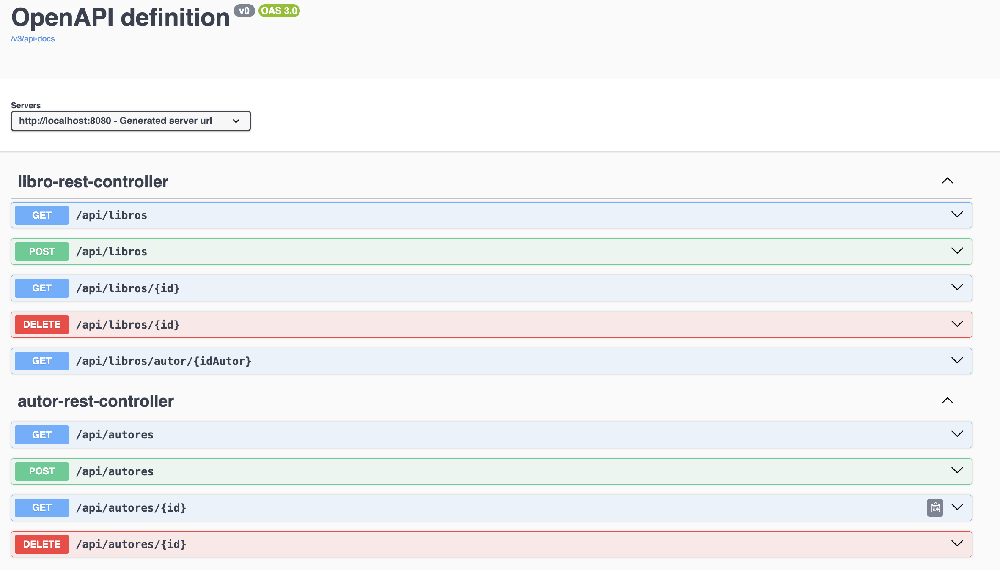
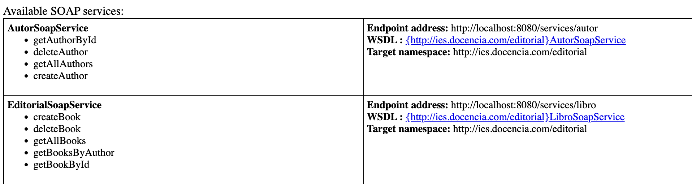

# Examen / Práctica: API Editorial REST + SOAP (CXF) con repositorios en memoria

## 1. Contexto

Dispones de un proyecto **Spring Boot 3** ya creado, con la estructura básica y las dependencias
configuradas para trabajar con:

- Servicios **REST** (`spring-boot-starter-web`).
- Servicios **SOAP** con **Apache CXF** (`cxf-spring-boot-starter-jaxws`).
- Documentación de API con **Swagger / OpenAPI** (`springdoc-openapi`).
- Repositorios **en memoria** (sin base de datos real).

El dominio de la aplicación es una **editorial**, con dos entidades:

- `Autor`: identifica a los autores.
- `Libro`: identifica a los libros, cada uno asociado a un autor mediante `idAutor`.

El objetivo del ejercicio es utilizar las capas de **repositorio**, y completar las capas **servicio**, **REST** y **SOAP**
que ya están creadas como esqueletos con `TODO`, de forma que toda la API funcione correctamente.

---

## 2. Estructura básica entregada

El proyecto ya incluye los siguientes paquetes y clases (no debes cambiar los paquetes):

- `com.docencia.pgv`
  - `EditorialApplication` (clase `main` de Spring Boot).
- `com.docencia.pgv.modelo`
  - `Autor` (POJO con `id`, `nombre`, `pais`).
  - `Libro` (POJO con `id`, `titulo`, `anioPublicacion`, `idAutor`).
- `com.docencia.pgv.repositorios`
  - **Interfaces**:
    - `AutorRepository`
    - `LibroRepository`
  - **Implementaciones en memoria (esqueleto)**:
    - `InMemoryAutorRepository`
      - Contiene una lista interna `datos` con **autores de ejemplo**.
    - `InMemoryLibroRepository`
      - Contiene una lista interna `datos` con **libros de ejemplo**.
- `com.docencia.pgv.interfaces`
  - `AutorService`
  - `LibroService`
- `com.docencia.pgv.servicios`
  - `AutorServiceImpl` (esqueleto con `TODO`).
  - `LibroServiceImpl` (esqueleto con `TODO`).
- `com.docencia.pgv.rest`
  - `AutorRestController` (esqueleto).
  - `LibroRestController` (esqueleto).
- `com.docencia.pgv.soap`
  - Interfaces:
    - `AutorSoapService`
    - `LibroSoapService`
  - Implementaciones (esqueleto):
    - `AutorSoapServiceImpl`
    - `LibroSoapServiceImpl`
- `com.docencia.pgv.config`
  - `CxfConfig` → crea y publica los endpoints SOAP en `/services/autores` y `/services/libros`.

El proyecto **compila**, pero gran parte de los métodos de repositorios, servicios,
controladores REST y servicios SOAP están sin implementar (`return List.of()`, `Optional.empty()`,
`throw new UnsupportedOperationException("TODO ...")`, etc.).

---

## 3. Trabajo a realizar

### 3.1. Repositorios en memoria (`com.docencia.pgv.repositorios`)

Debes completar las implementaciones:

- `InMemoryAutorRepository implements AutorRepository`
- `InMemoryLibroRepository implements LibroRepository`

Las interfaces definen los métodos que deben funcionar:

- `AutorRepository` (5 métodos)
  - `List<Autor> findAll()`
  - `Optional<Autor> findById(Long id)`
  - `Autor save(Autor autor)`
  - `boolean deleteById(Long id)`
  - `void deleteAll()`

- `LibroRepository` (6 métodos)
  - `List<Libro> findAll()`
  - `Optional<Libro> findById(Long id)`
  - `List<Libro> findByIdAutor(Long idAutor)`
  - `Libro save(Libro libro)`
  - `boolean deleteById(Long id)`
  - `void deleteAll()`

**Requisitos:**

1. Usar la lista interna `datos` para almacenar los objetos en memoria.
2. Mantener los **datos de ejemplo** que ya hay en los constructores.
3. En `save`:
   - Si el `id` es `null`, generar uno nuevo (p. ej. con un contador interno) y añadir.
   - Si el `id` existe, sustituir el registro anterior.
4. En `findAll`, devolver **copias de la lista** (no la lista interna directamente).
5. `deleteById` debe devolver `true` si se ha borrado algún elemento y `false` en caso contrario.

Documenta las clases y métodos con comentarios Javadoc sencillos.

---

### 3.2. Capa de servicios (`com.docencia.pgv.servicios`)

Debes completar:

- `AutorServiceImpl implements AutorService`
- `LibroServiceImpl implements LibroService`

Las interfaces a cumplir:

- `AutorService` (4 métodos)
  - `List<Autor> findAll()`
  - `Autor findByIdOrThrow(Long id)`
  - `Autor create(Autor autor)`
  - `void delete(Long id)`

- `LibroService` (5 métodos)
  - `List<Libro> findAll()`
  - `Libro findByIdOrThrow(Long id)`
  - `List<Libro> findByAutorOrThrow(Long idAutor)`
  - `Libro create(Libro libro)`
  - `void delete(Long id)`

**Requisitos de lógica:**

1. Usar los repositorios in-memory (inyectados por Spring) para acceder a los datos.
2. `findByIdOrThrow` debe lanzar `IllegalArgumentException` si no se encuentra el recurso.
3. `create(Autor)`:
   - Validar que `nombre` no es nulo ni vacío.
   - Poner `id` a `null` antes de guardar (para que el repositorio genere uno nuevo).
4. `create(Libro)`:
   - Validar que el `titulo` no es nulo ni vacío.
   - Validar que `idAutor` no es `null`.
   - Verificar que el autor existe (por ejemplo, usando `AutorService`).
5. `delete(Long id)`:
   - Si `deleteById` del repositorio devuelve `false`, lanzar `IllegalArgumentException`.

También aquí se valoran comentarios Javadoc y claridad de nombres.

---

### 3.3. Controladores REST (`com.docencia.pgv.rest`)

Debes completar:

- `AutorRestController` (`/api/autores`)
- `LibroRestController` (`/api/libros`)

Endpoints esperados:

#### Autores (`/api/autores`)

- `GET /api/autores`
  - Devuelve `200 OK` con la lista de autores.

- `GET /api/autores/{id}`
  - `200 OK` con el autor si existe.
  - `404 Not Found` si el autor no existe.

- `POST /api/autores`
  - Body JSON con `nombre` y `pais`.
  - `200 OK` o `201 Created` con el autor creado.
  - `400 Bad Request` si los datos no son válidos.

- `DELETE /api/autores/{id}`
  - `204 No Content` si se borra correctamente.
  - `404 Not Found` si no existe.

#### Libros (`/api/libros`)

- `GET /api/libros`
  - `200 OK` con lista de libros.

- `GET /api/libros/{id}`
  - `200 OK` con el libro.
  - `404 Not Found` si no existe.

- `GET /api/libros/autor/{idAutor}`
  - `200 OK` con la lista de libros de ese autor.
  - `404 Not Found` si el autor no existe.

- `POST /api/libros`
  - Body JSON con `titulo`, `anioPublicacion`, `idAutor`.
  - `200 OK` o `201 Created` con el libro creado.
  - `400 Bad Request` si los datos no son válidos.

- `DELETE /api/libros/{id}`
  - `204 No Content` si se borra.
  - `404 Not Found` si no existe.

---

### 3.4. Servicios SOAP (CXF) (`com.docencia.pgv.soap`)

Ya están definidas las **interfaces**:

- `AutorSoapService` (4 operaciones):
  - `getAllAuthors()`
  - `getAuthorById(id)`
  - `createAuthor(nombre, pais)`
  - `deleteAuthor(id)`
  - `targetNamespace = "http://ies.docencia.com/autor"`

- `LibroSoapService` (5 operaciones):
  - `getAllBooks()`
  - `getBookById(id)`
  - `getBooksByAuthor(idAutor)`
  - `createBook(titulo, anioPublicacion, idAutor)`
  - `deleteBook(id)`
  - `targetNamespace = "http://ies.docencia.com/libro"`

  > **Nota:** Anota de forma correcta, el sevicePort, serviceName, etc acorde con el servicio que se esta trabajando (`Libro/Autor`).

Debes completar las implementaciones:

- `AutorSoapServiceImpl`
- `LibroSoapServiceImpl`

**Requisitos:**

1. Anotaciones `@Service` y `@WebService(endpointInterface = ...)` ya están dadas, respétalas.
2. Debes **delegar toda la lógica** en `AutorService` y `LibroService`.
3. La configuración CXF (`CxfConfig`) ya publica los endpoints en:
   - `http://localhost:8080/services/autores?wsdl`
   - `http://localhost:8080/services/libros?wsdl`

Comprueba que el WSDL se genera correctamente y que las operaciones funcionan desde un cliente SOAP
(SoapUI, Postman, IntelliJ, etc.).

---

### 3.5. Documentación y organización

- Mantén el código ordenado por paquetes:
  - `modelo`, `repositorios`, `interfaces`, `servicios`, `rest`, `soap`, `config`.
- Añade comentarios Javadoc **sencillos** en:
  - Interfaces de servicio.
  - Clases de implementación.
  - Controladores REST.
  - Servicios SOAP.
- No es necesario escribir documentación extensa, pero sí clara y coherente.

---

## 4. Cómo ejecutar el proyecto

1. Compilar y verificar que compita y pasan los test:

   ```bash
   mvn clean test
   ```

2. Arrancar la aplicación:

   ```bash
   mvn clean spring-boot:run
   ```

3. Verificar:

   - **Swagger / REST**:
     - `http://localhost:8080/swagger-ui.html`
   - **SOAP**:
     - Autores: `http://localhost:8080/services/autores?wsdl`
     - Libros: `http://localhost:8080/services/libros?wsdl`






---

